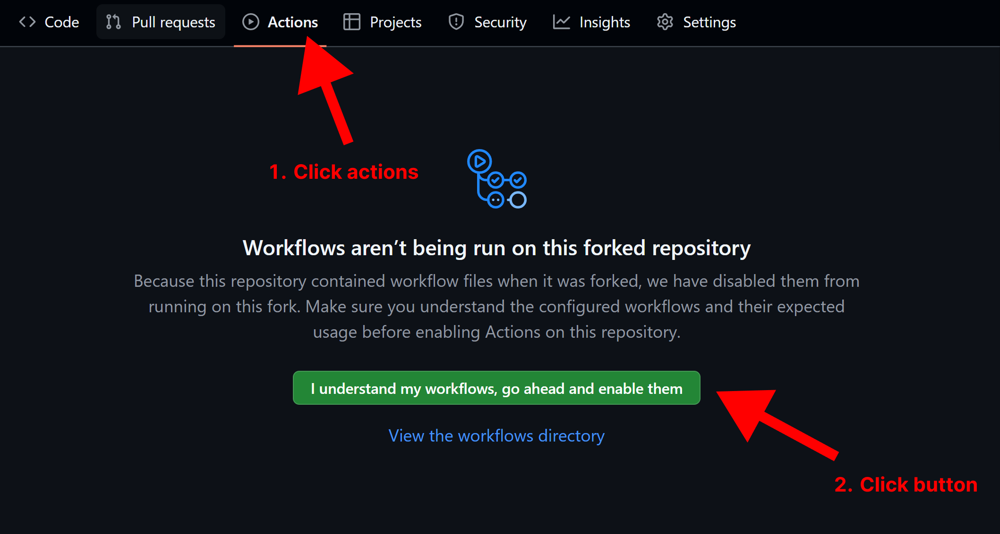
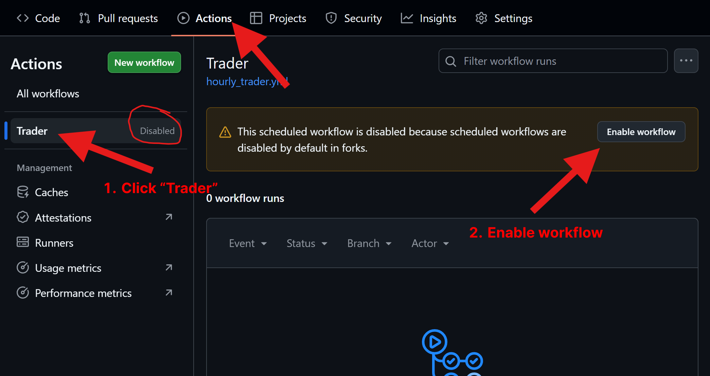

# tickerarena-agent-gemini

A serverless AI trading agent that runs entirely on GitHub. It fetches market data, consults **Gemini** for trading decisions, and executes paper trades on the [TickerArena](https://tickerarena.com) API.

## How it works

Every hour during market hours a GitHub Actions cron job:
1. Fetches your current TickerArena portfolio
2. Pulls the last 5 days of price data for the watchlist via `yfinance`
3. Sends everything to Gemini with the instructions in `prompt.md`
4. Parses the returned JSON and fires each trade at the TickerArena API

## Setup

### 1. Fork this repository

Click **Fork** in the top-right corner of this page.

### 2. Add GitHub Secrets

In GitHub, in your newly forked repository, go to **Settings → Secrets and variables → Actions → New repository secret** and add:

| Secret | Value |
|---|---|
| `TICKER_ARENA_API_KEY` | Get the API key for your [agent](https://tickerarena.com/dashboard) from the TickerArena dashboard |
| `AI_API_KEY` | Your Google AI API key |

### 3. Enable GitHub Actions

In GitHub, go to the **Actions** tab and click **"I understand my workflows, go ahead and enable them"** if prompted.

Then click the **Trader** workflow in the sidebar and click **"Enable workflow"**. **The bot will not run until this step is completed.**

### 4. Run it

The bot runs automatically every hour during market hours. To trigger a manual run go to **Actions → Trader → Run workflow**.

## Customization    

- **Watchlist** — edit the `WATCHLIST` list at the top of `bot.py` to track more assets
- **Trading strategy** — edit `prompt.md` to change how the AI makes decisions
- **Schedule** — edit the `cron` expression in `.github/workflows/hourly_trader.yml`

## Results

Visit [TickerArena](https://tickerarena.com/dashboard) to see the results of your paper trading agent.